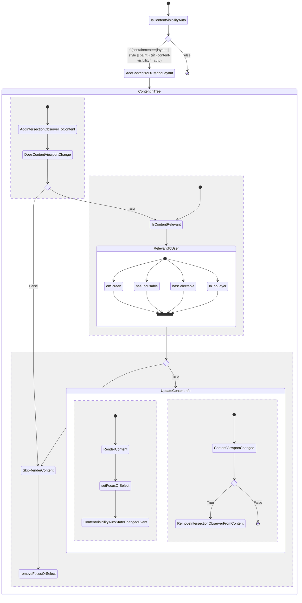

```mermaid
  stateDiagram-v2
    state if_state1 <<choice>>
    [*] --> IsContentVisibilityAuto
    IsContentVisibilityAuto --> if_state1
    %% AddContentToDOMandLayout: Add content to DOM tree and Layout Tree
    if_state1 --> AddContentToDOMandLayout : if (containment==(layout || style || paint)) && (content-visibility==auto)
    if_state1 --> [*]: else

    AddContentToDOMandLayout --> ContentInTree
    state ContentInTree {
        [*] --> AddIntersectionObserverToContent
        state if_state2 <<choice>>
        AddIntersectionObserverToContent --> DoesContentViewportChange
        DoesContentViewportChange --> if_state2
        if_state2 --> IsContentRelevant: True
        if_state2 --> SkipRenderContent : False
        --
        [*] --> IsContentRelevant
        state if_state3 <<choice>>
        IsContentRelevant --> RelevantToUser
        RelevantToUser --> if_state3

        state RelevantToUser {
            state join_state <<join>>
            [*] --> onScreen
            onScreen --> join_state
            [*] --> hasFocusable
            hasFocusable --> join_state
            [*] --> hasSelectable
            hasSelectable --> join_state
            [*] --> InTopLayer
            InTopLayer --> join_state
        }
        --
        if_state3 --> UpdateContentInfo: True
        if_state3 --> SkipRenderContent : False
        SkipRenderContent --> removeFocusOrSelect
        state UpdateContentInfo {
            [*] --> RenderContent
            RenderContent --> setFocusOrSelect
            setFocusOrSelect --> ContentVisibilityAutoStateChangedEvent
            --
            [*] --> ContentViewportChanged
            state if_state4 <<choice>>
            ContentViewportChanged --> if_state4
            if_state4 --> RemoveIntersectionObserverFromContent: True
            if_state4 --> [*]: False
        }
    }

```
