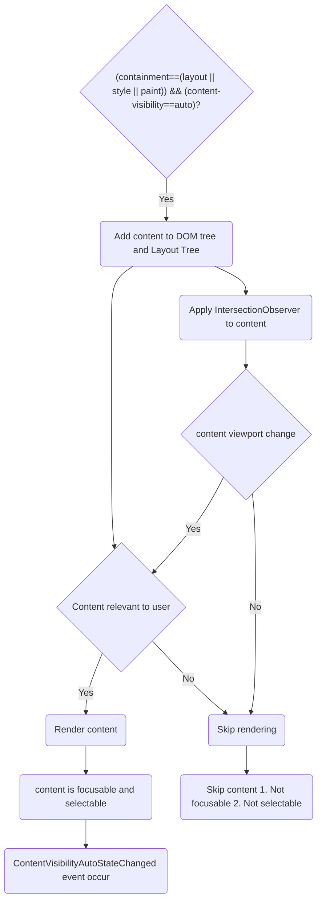

```mermaid
  flowchart TD
    A{"(containment==(layout || style || paint)) && (content-visibility==auto)"? } -->|Yes| B(Add content to DOM tree and Layout Tree)
    B --> C(Apply IntersectionObserver to content) & D{Content relevant to user}
    C --> C1{content viewport change}
    C1 --> |Yes| D
    %% What happen when the content get focus by Element.focus({preventScroll:true});
    D -->|"Yes"| E(Render content)
    D -->|"No"| F(Skip rendering)
    C1 --> |No| F
    E --> E1(content is focusable and selectable)
    F --> F1(Skip content 1. Not focusable 2. Not selectable)
    E1 --> E2(ContentVisibilityAutoStateChanged event occur)
    click D "https://drafts.csswg.org/css-contain/#relevant-to-the-user" _blank

```
