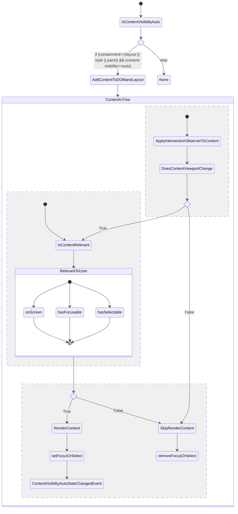

```mermaid
  stateDiagram-v2
    state if_state1 <<choice>>
    [*] --> IsContentVisibilityAuto
    IsContentVisibilityAuto --> if_state1
    %% AddContentToDOMandLayout: Add content to DOM tree and Layout Tree
    if_state1 --> AddContentToDOMandLayout : if (containment==(layout || style || paint)) && (content-visibility==auto)
    if_state1 --> None: else

    AddContentToDOMandLayout --> ContentInTree
    state ContentInTree {
        [*] --> ApplyIntersectionObserverToContent
        state if_state2 <<choice>>
        ApplyIntersectionObserverToContent --> DoesContentViewportChange
        DoesContentViewportChange --> if_state2
        if_state2 --> IsContentRelevant: True
        if_state2 --> SkipRenderContent : False
        --
        [*] --> IsContentRelevant
        state if_state3 <<choice>>
        IsContentRelevant --> RelevantToUser
        RelevantToUser --> if_state3
        state RelevantToUser {
            [*] --> onScreen
            onScreen --> [*]
            [*] --> hasFocusable
            hasFocusable --> [*]
            [*] --> hasSelectable
            hasSelectable --> [*]
        }
        --
        if_state3 --> RenderContent: True
        if_state3 --> SkipRenderContent : False
        RenderContent --> setFocusOrSelect
        setFocusOrSelect --> ContentVisibilityAutoStateChangedEvent
        SkipRenderContent --> removeFocusOrSelect
    }

```
